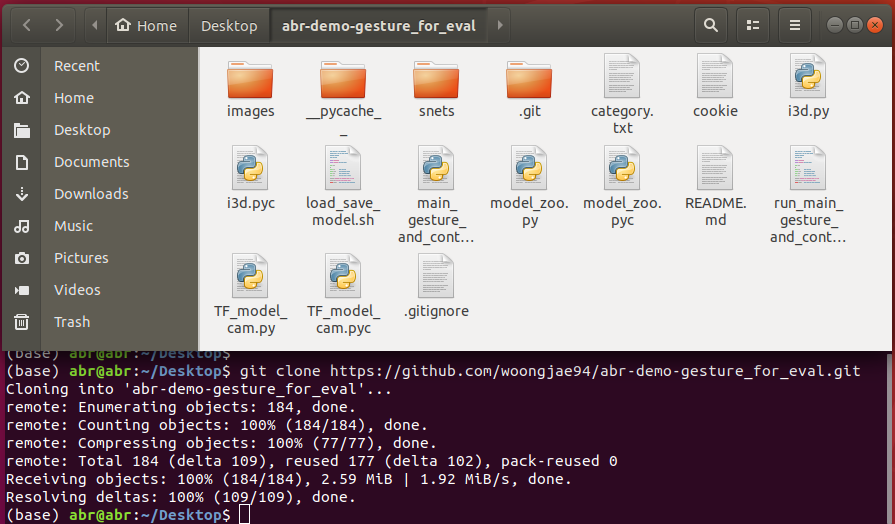
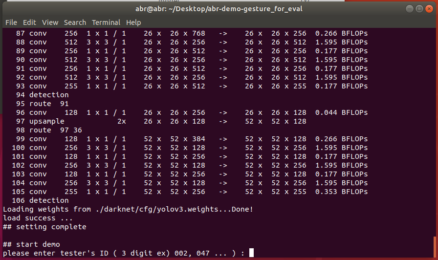
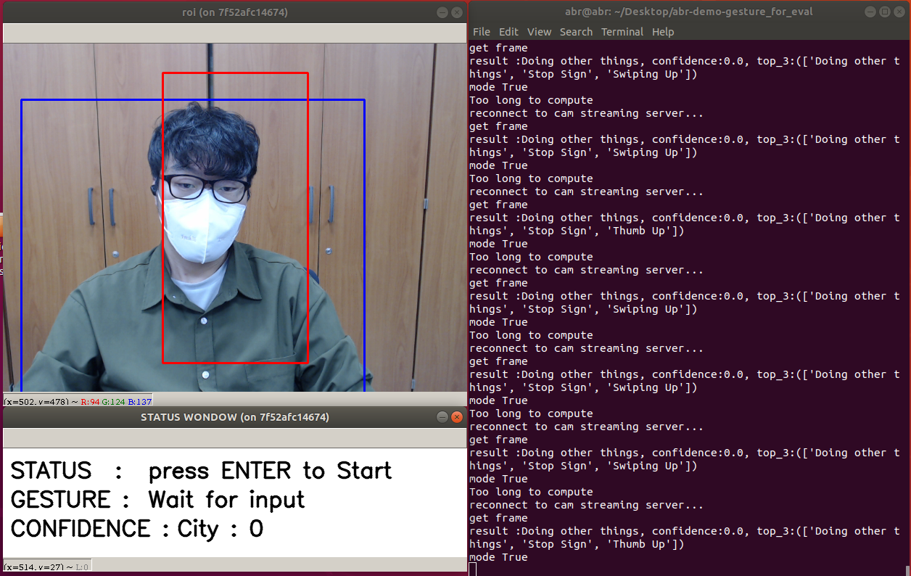
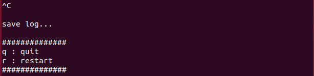
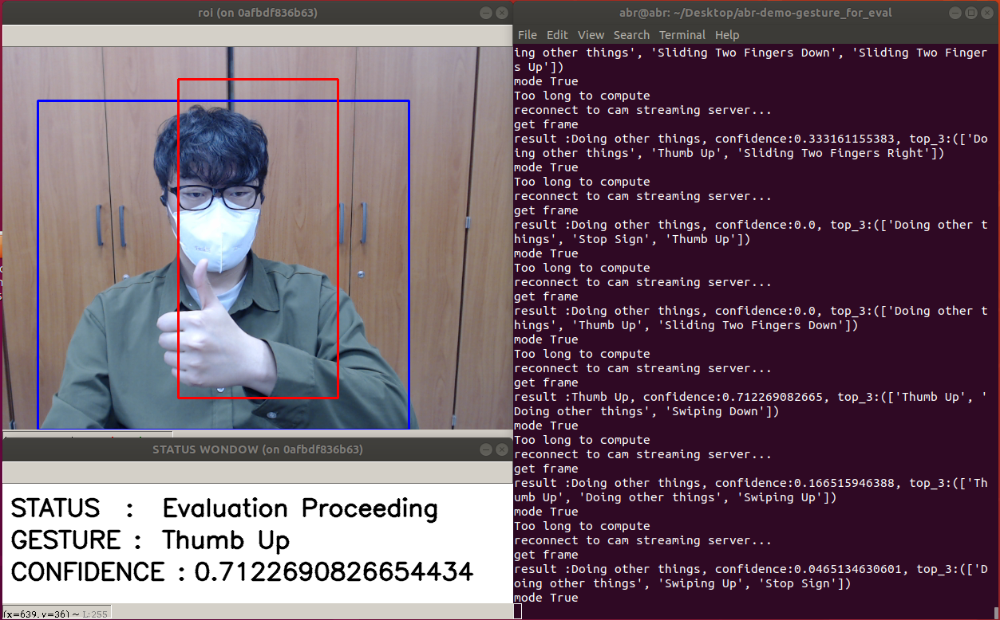

# KNU ABR LAB Gesture Recognition

------------------------------------------------------


## 0. USER MANUAL

* 이 문서는 프로그램을 사용하는 사용자를 위한 설명서입니다.


## 1. Version info

* Python :  2.7.12
* CUDA : 8.x
* CuDNN : 7.x
* Ubuntu 18.04
* Any webcam


## 2. Installation

 우분투 '/Desktop' 폴더에 현 저장소를 Clone 합니다.

```bash
git clone  https://github.com/hi1049/gesture_tf_socket.git
```




## 3. STEPS TO RUN PROGRAM

생성된 폴더 내에서 아래 명령어를 실행한다.

```bash
sh run_main_gesture_and_control.sh
```

* 정상적으로 실행될 경우 아래와 같이 모델이 Load되고, 터미널에 관련 정보가 표시된다.

  

* 위 화면에서 테스터의 ID를 입력하고(영어와 숫자를 사용한다.) Enter 키를 누른다.



* 위와 같이 카메라 입력영상과 아래 STATUS 윈도우가 생성되며 프로그램이 시작된다. 이후 아래 **4. Supported Gesture List** 에 명시된 제스쳐를 수행하면 그에 맞는 결과를 얻을 수 있다.


**프로그램 종료 방법**

* 터미널 상에서 **Ctrl+C** 키를 입력하면 아래와 같은 대화창이 생성된다.

  

* 위 화면에서 **q** 를 입력하면 정상종료되고 **r**을 입력하면 재시작된다.


## 4. Supported Gesture List

``` python
## 모델이 인식하는 제스쳐는 아래와 같다.
Swiping Up
Sliding Two Fingers Up
Swiping Left
Thumb Up
Sliding Two Fingers Right
Stop Sign
Sliding Two Fingers Left
Sliding Two Fingers Down
Rolling Hand Backward
Doing other things
Swiping Right
Swiping Down
Thumb Down
```


## 5. Example




